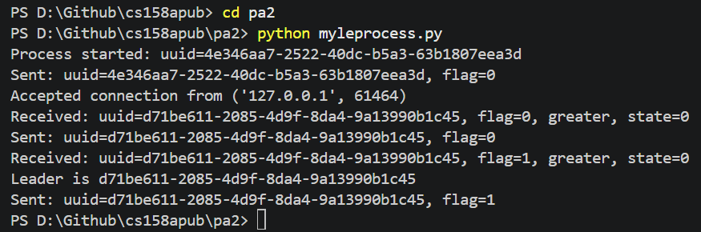
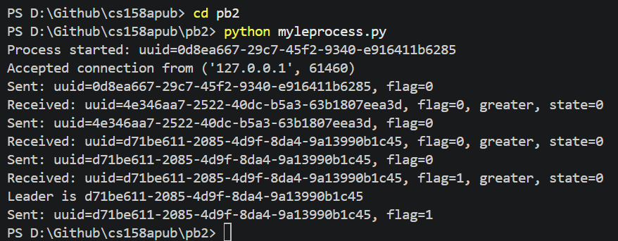
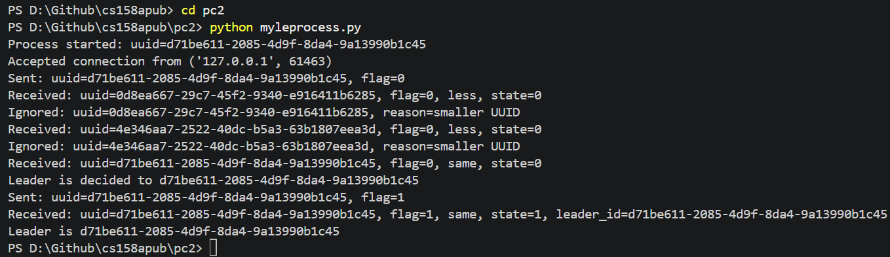

````markdown
# PA2 Leader Election

This program creates a process in a TCP ring and uses UUIDs to elect a leader.

Each process:

- Generates a UUID.
- Connects to the next process.
- Sends and receives UUID messages.
- Forwards larger UUIDs.
- Ignores smaller UUIDs.
- Announces the leader using `flag=1`.

## How to Run

Place `myleprocess.py` and `config.txt` in the same folder.

Run the program from PowerShell:

```powershell
cd D:\Github\cs158apub\pa2
python myleprocess.py
````

Run the other two processes from their own folders in separate terminals.

The program writes its output to the terminal and to a log file.

## Execution Example

```text
Process started: uuid=4e346aa7-2522-40dc-b5a3-63b1807eea3d
Sent: uuid=4e346aa7-2522-40dc-b5a3-63b1807eea3d, flag=0
Accepted connection from ('127.0.0.1', 61464)
Received: uuid=d71be611-2085-4d9f-8da4-9a13990b1c45, flag=0, greater, state=0
Sent: uuid=d71be611-2085-4d9f-8da4-9a13990b1c45, flag=0
Leader is d71be611-2085-4d9f-8da4-9a13990b1c45
```

The process with the greatest UUID becomes the leader.

```markdown
## Screenshots

### Process 1



### Process 2



### Process 3


```